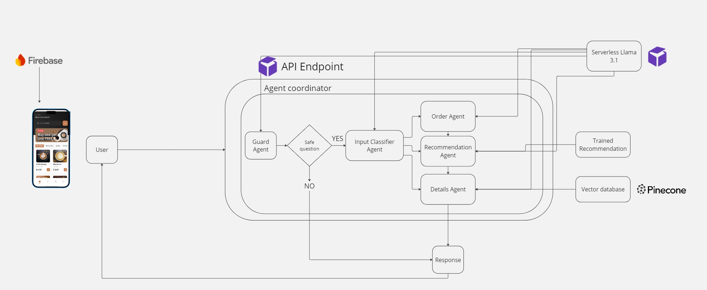

# Coffee Shop Customer Service Chatbot 🚀☕️

Hey there! This is my **Coffee Shop Customer Service Chatbot** project. It's a smart assistant built to enhance the user experience in a coffee shop app. Using **LLMs**, **NLP**, and **RunPod**, this chatbot helps customers place orders, ask menu-related questions, and get personalized product suggestions—all through a sleek **React Native** mobile app.

---

## 🎯 What This Project Is About

The main goal was to create an AI-powered chatbot that could:

- Handle real-time customer interactions for ordering.
- Answer menu questions (ingredients, allergens, etc.) using a **RAG (Retrieval-Augmented Generation)** system.
- Provide product recommendations via a **market basket analysis** engine.
- Guide users through a structured and smooth ordering process.
- Block harmful or irrelevant queries using a **Guard Agent**.

---

## 🔧 What I Learned

This project was super hands-on and I learned a ton, including how to:

- Deploy an LLM on **RunPod**.
- Build an **agent-based system** with Order, Details, Guard, and Recommendation agents.
- Set up a **vector database** for storing and retrieving menu info.
- Implement **RAG** for detailed, context-aware responses.
- Train and use a **recommendation engine**.
- Create and integrate it all into a **React Native** mobile app.

---

## 🧠 Chatbot Agent Architecture

The chatbot uses a **modular agent-based architecture**. Each agent has a specific role, which keeps the system clean, scalable, and easy to maintain.

### 🤖 Agents:

- **Guard Agent**: Filters out harmful or irrelevant queries.
- **Order Taking Agent**: Uses chain-of-thought prompting to take and structure orders.
- **Details Agent**: A RAG-powered agent that answers questions about the menu.
- **Recommendation Agent**: Provides smart product suggestions based on user input.
- **Classification Agent**: Routes each query to the correct agent based on intent.

---

## ⚙️ Agent Workflow

Here’s how the agents work together:

1. User query comes in.
2. **Guard Agent** checks it for safety.
3. **Classification Agent** decides what the user wants.
4. Query is forwarded to:
   - **Order Agent** (for orders)
   - **Details Agent** (for product info)
   - **Recommendation Agent** (for suggestions)
5. Agents can also hand off tasks to each other (e.g., Order → Recommendation).

---

## 📱 React Native Coffee Shop App

The React Native app is the front-end where users interact with the chatbot:

- **Landing Page**: Welcoming start to the experience.
- **Home Page**: Featured items and categories.
- **Item Details Page**: Menu item info, including allergens.
- **Cart Page**: Lets users review and adjust their orders.
- **Chatbot Interface**: Chat-based interaction for ordering, info, and recommendations.

---

# 📂 Project Structure
<pre><code>├── coffee_shop_customer_service_chatbot
│   ├── coffee_shop_app_folder # Contains React Native app code   
│   ├── python_code
│       ├── API/               # Chatbot API for agent-based system
│       ├── dataset/           # Dataset for training recommendation engine    
│       ├── products/          # Product data (names, prices, descriptions, images)   
│       ├── build_vector_database.ipynb             # Builds vector database for RAG model   
│       ├── firebase_uploader.ipynb                 # Uploads products to Firebase    
│       ├── recommendation_engine_training.ipynb    # Trains recommendation engine 
</code></pre>

---

## 🚀 Getting Started

Each folder has their own getting started section. So this way we can deploy the front end, backend and setup individually.

---

## 🚀 Tech Stack

### 🖥️ Frontend
- React Native with Expo
- TailwindCSS for styling
- React Navigation for routing
- Node.js (for CLI or scripting needs)

### 🧠 AI / NLP
- OpenAI & Hugging Face APIs
- Custom-trained LLM hosted on RunPod
- Retrieval-Augmented Generation (RAG)
- LangChain for orchestration

### 🗃️ Data & Storage
- Pinecone (vector database for semantic search)
- Firebase (for structured storage and syncing)
- JSON & CSV datasets (for menu items, training, and user interactions)

### 🔧 Backend & ML
- Python (core backend & logic)
- Jupyter Notebooks (for model training & experimentation)
- Custom-built agent framework (Guard, Order, Details, Recommendation, Classification)
- Market Basket Recommendation Engine (scikit-learn, pandas)

### ☁️ Infrastructure
- RunPod (for deploying custom LLMs and backend services)
  
---

## Demo 

[Demo Link](https://drive.google.com/file/d/1MblD1TVxunZ9Kg7K9-h41cSDR5h5gUmd/view?usp=sharing)

---

## 🔗 Refrence Links
- [RunPod](https://www.runpod.io/): RunPod Official Site - Infrastructure for deploying and scaling machine learning models.
- Kaggle Dataset: Source of the dataset used for training the recommendation engine.
- [Figma app design]([https://www.figma.com/](https://www.figma.com/design/PKEMJtsntUgQcN5xAIelkx/Coffee-Shop-Mobile-App-Design--Community-?node-id=421-1221&t=tJ8hpXa5rKhDLlVF-0)): - The design mockups for the coffee shop app, providing a visual guide for the user interface and experience.
- [Hugging Face](https://huggingface.co/meta-llama/Llama-3.1-8B-Instruct): Hugging Face Models - Repository for Llama LLms, a state-of-the-art NLP model used in our chatbot.
- [Pinecone](https://docs.pinecone.io/guides/get-started/quickstart): Pinecone Documentation - Documentation for the vector database used in the project.
- [Firebase](https://firebase.google.com/docs): Firebase Documentation - Comprehensive guide for using Firebase to manage app data for the coffee shop app.
