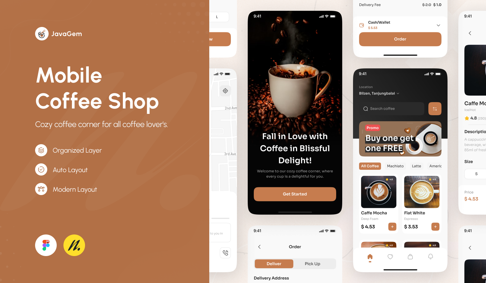

# Coffee Shop Customer Service Chatbot 🚀☕️

Hey there! This is my **Coffee Shop Customer Service Chatbot** project. It's a smart assistant built to enhance the user experience in a coffee shop app. Using **LLMs**, **NLP**, and **RunPod**, this chatbot helps customers place orders, ask menu-related questions, and get personalized product suggestions—all through a sleek **React Native** mobile app.

---

## 🎯 What This Project Is About

The main goal was to create an AI-powered chatbot that could:

- Handle real-time customer interactions for ordering.
- Answer menu questions (ingredients, allergens, etc.) using a **RAG (Retrieval-Augmented Generation)** system.
- Provide product recommendations via a **market basket analysis** engine.
- Guide users through a structured and smooth ordering process.
- Block harmful or irrelevant queries using a **Guard Agent**.

---

## 🔧 What I Learned

This project was super hands-on and I learned a ton, including how to:

- Deploy an LLM on **RunPod**.
- Build an **agent-based system** with Order, Details, Guard, and Recommendation agents.
- Set up a **vector database** for storing and retrieving menu info.
- Implement **RAG** for detailed, context-aware responses.
- Train and use a **recommendation engine**.
- Create and integrate it all into a **React Native** mobile app.

---

## 🧠 Chatbot Agent Architecture

The chatbot uses a **modular agent-based architecture**. Each agent has a specific role, which keeps the system clean, scalable, and easy to maintain.

### 🤖 Agents:

- **Guard Agent**: Filters out harmful or irrelevant queries.
- **Order Taking Agent**: Uses chain-of-thought prompting to take and structure orders.
- **Details Agent**: A RAG-powered agent that answers questions about the menu.
- **Recommendation Agent**: Provides smart product suggestions based on user input.
- **Classification Agent**: Routes each query to the correct agent based on intent.

---

## ⚙️ Agent Workflow

Here’s how the agents work together:

1. User query comes in.
2. **Guard Agent** checks it for safety.
3. **Classification Agent** decides what the user wants.
4. Query is forwarded to:
   - **Order Agent** (for orders)
   - **Details Agent** (for product info)
   - **Recommendation Agent** (for suggestions)
5. Agents can also hand off tasks to each other (e.g., Order → Recommendation).

---

## 📱 React Native Coffee Shop App

The React Native app is the front-end where users interact with the chatbot:

- **Landing Page**: Welcoming start to the experience.
- **Home Page**: Featured items and categories.
- **Item Details Page**: Menu item info, including allergens.
- **Cart Page**: Lets users review and adjust their orders.
- **Chatbot Interface**: Chat-based interaction for ordering, info, and recommendations.

---

## 📂 Project Structure
coffee_shop_customer_service_chatbot/ ├── coffee_shop_app_folder # React Native front-end └── python_code/ ├── API/ # Backend logic for chatbot agents ├── dataset/ # Training data for recommendation engine ├── products/ # Product info (names, images, etc.) ├── build_vector_database.ipynb ├── firebase_uploader.ipynb └── recommendation_engine_training.ipynb
